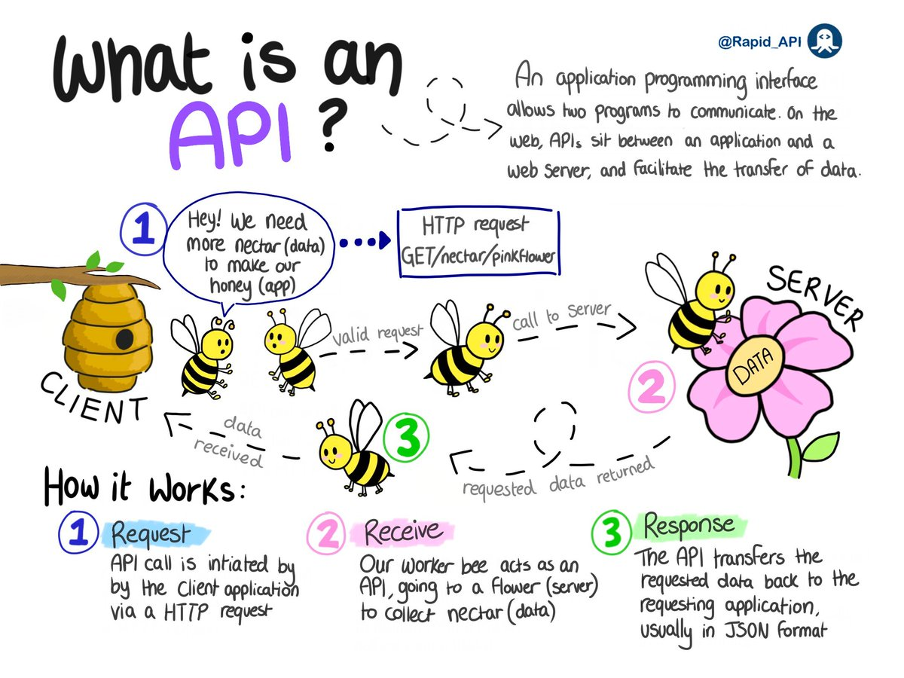
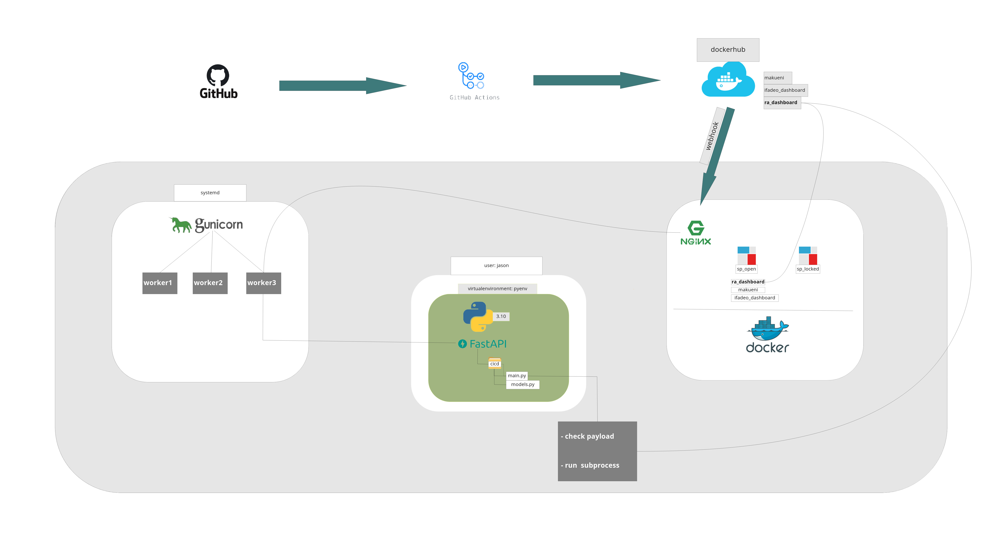

# SPATIAL DASHBOARDS CICD PIPELINE
## API 
What's an API? 
Its simply an application that sits between a web server and an application to facilitate data transfer. The image below does some justice in explaining how it works. 



## FastAPI  
FastAPI is a modern, fast (high-performance), web framework for building APIs with Python 3.7+ based on standard Python type hints.   
FastAPI is very fast, as the name suggests, due to its out-of-the-box support of the async feature of Python 3.6+.   

### Installation  
```
$ pip install fastapi

```
###  Install an ASGI server : Uvicorn   

[Uvicorn](https://www.uvicorn.org/#why-asgi) is an ASGI web server implementation for python.    
[ASGI](https://asgi.readthedocs.io/en/latest/) (Asynchronous Server Gateway Interface) provides a standard interface between async-capable Python web servers, frameworks, and applications.  
In this case we'll have it linked to nginx webserver to forward requests to the FastAPI.   

```
$ pip install "uvicorn[standard]"  

```
Let's create a simple app and see how to run it using uvicorn.  

### Create a file myapp.py inside a directory 
Create a directory and name it as you wish, I'll call mine fastapiApp and place the .py file inside, mine is myapp.py.  
Below is a hello-world example of a fastAPI   

```
from fastapi import FastAPI

app = FastAPI()


@app.get("/")
async def root():
    return {"message": "Hello World"}


```
Now here's what's happening in the code above.  
  * The *from fastapi import FastAPI* : _Importing the required packages and functions._    
  * The *app = FastAPI()* : _We create an instance of the class FastAPI and assign it the name app. You can name it differently if you so wish_ 
  * *@app.get("/")*:  _Creates a *GET* path._ It tells FastAPI that the function right below is in charge of handling requests that go to _the path /_ using a _get_ operation.   
  This is possible using the *@* decorator.  
  * And now the part that starts with *async def root()* : _is the function that will be executed when someone visits the *GET* path of which, as in our case, the response to the user will be  *{"message": "Hello World"}*_. You're at liberty to define the function normally as  _(def root()...)_ instead of _(async def root()...)_.   
  
Note:  
  * The *get* in *@app.get("/")* is one of the HTTP methods/operations used to perform specific actions in response to a prompt from a client. 
  * Some of the methods are: 
    - POST: to create data 
    - GET: to read data  
    - PUT: to update data  
    - DELETE: to delete data   
 In our case we'll focus on POST and GET operations. GET to feedback to the client/user i.e telling them *{"Hello": "All is well"}* and POST for requests    
 
### Running the application    

Once you have your application set up as above, on the terminal navigate to a folder right above your project folder and run the application using the below commands.  

```
$ uvicorn myapp:app 

```
Here's what's happening   

  - *myapp* is the file myapp.py   
  - *app* is the FastAPI instance we created inside the myapp.py file. Remember the line _app=FastAPI()_. 
  
Once you run the command you'll have an output as below  

```
you@yourpc:~/Documents/myprojects/fastapiApp$ uvicorn myapp:app
INFO:     Started server process [195281]
INFO:     Waiting for application startup.
INFO:     Application startup complete.
INFO:     Uvicorn running on http://127.0.0.1:8000 (Press CTRL+C to quit)

```

Take the last line which has the url (http://127.0.0.1:8000) and paste it on your browser, you'll see the response that we defined under the get operation. 

```
{"message": "Hello World"}

```

### The building blocks of a FastAPI application  

#### Path parameter  
This is a variable (contained within curly braces) within the path of an endpoint that is used to point to a specific resource. 
Each parameter must be substituted with an actual value when a client makes an API call.  
Put the code below in your .py script and run it with uvicorn as above
```
from fastapi import FastAPI

app = FastAPI()


@app.get("/Documents/{item}")
async def read_item(item_id):
    return {"You are inside": item}

```

then run 

```
uvicorn main:app 

```

Paste the url http://127.0.0.1:8000/docs on your browser and try inserting a variable in the parameter to see how the app operates/responds. 

#### Query parameters    
These are variables that are used to sort/filter resource(s). They are optional key-value pairs at the end of a URL after the question mark and are separated by & characters.  

```

from fastapi import FastAPI

app = FastAPI()

books_db = [{"book_name": "The Monk who sold his ferrari"}, {"book_name": "Desire of Ages"}, {"book_name": "Rich dad poor dad"}]

@app.get("/movies/" )
def get_book(skip: int = 0, limit: int = 10):
    return books_db[skip: skip + limit]

```
As in the example 2, run the app using _uvicorn main:app_ and on your browser paste the url http://127.0.0.1:8000/books/skip=0?limit=10  

#### Request body   
A request body is data sent by the client to your API. You can use pydantic models to declare the structure of the data, rather, what your API should expect. 
In our case we're actually using request body cause we're looking at a scenario where dockerhub (the client in this case) sends data in form of a json payload. 

```
from typing import Union

from fastapi import FastAPI
from pydantic import BaseModel


class Payload(BaseModel):
    reponame: str
    repo_url: Union[str, None] = None
    tag: str
    pusher: Union[float, None] = None


app = FastAPI()


@app.post("/items/")
async def create_item(item: Item):
    return item


```

## Pydantic models  
This is a python library used to declare, validate and parse data. In the context of an API, data coming from a request, further, in our example the json payload coming from dockerhub. 

Having looked at the various components of a FastAPI application see below the app that recieves and processes a payload from dockerhub. 

## entire code : example 

```
import json, string, random, subprocess, logging, requests
from urllib import request
from fastapi import FastAPI, BackgroundTasks, HTTPException, Request
from fastapi.encoders import jsonable_encoder
from starlette import status
from pydantic import BaseSettings
from typing import Union, List
from pydantic import BaseModel, Field
from datetime import datetime

logging.basicConfig(format='%(asctime)s - %(levelname)s - %(message)s', datefmt='%d/%m/%Y %H:%M:%S %Z', level=logging.DEBUG)

# load settings from .env file where you could define your credentials to access
# https://pydantic-docs.helpmanual.io/usage/settings/#dotenv-env-support
class Settings(BaseSettings):
    title: str = "Dashboards Webhook"
    env: str = 'dev'
    root_path: str = ""
    docs_url: Union[str, None] = None
    redoc_url: Union[str, None] = None
    cr_user: Union[str, None] = None
    cr_token: Union[str, None] = None

    class Config:
        env_file = '.env'

settings = Settings()
# disable API documentor in production


class PushData(BaseModel):
    pushed_at: datetime = Field(
        datetime.fromtimestamp(1645586259),
        title="date-time when the image was pushed",
        example=datetime.fromtimestamp(1645586259)
    )
    pusher: str = Field(
        "account1",
        title="pusher account username",
        example="account1"
    )
    tag: str = Field(
        "latest",
        title="image tag",
        example="latest"
    )

class Repository(BaseModel):
    namespace: str = Field(
        "account1",
        title="pusher account username",
        example="account1"
    )
    owner: str = Field(
        "account1",
        title="image account owner username",
        example="account1"
    )
    name: str = Field(
        "geo-api",
        title="docker image name",
        example='geo-api'
    )
    repo_name: str = Field(
        "account1/geo-api",
        title="docker image tag",
        example="account1/geo-api"
    )
    repo_url: str = Field(
        "https://hub.docker.com/r/account1/geo-api",
        title="image url on dockerhub registry",
        example="https://hub.docker.com/r/account1/geo-api"
    )
    date_created: datetime = Field(
        datetime.fromtimestamp(1644329839),
        title="Image creation timestamp",
        example=datetime.fromtimestamp(1644329839)
    )
    description: Union[str, None] = Field(
        None,
        title="push action description",
        example="short-description-string"
    )
    dockerfile: str = Field(
        None,
        title="dockerfile content",
        example="astring"
    )
    full_description: str = Field(
        None,
        title="full action description",
        example="Docker Hub based automated build from a GitHub repo"
    )
    comment_count: int = Field(
        0, 
        title="Pushed image comments count",
        example=0
    )
    is_official: bool  = Field(
        False,
        title="is the image official?",
        example=False
    )
    is_private: bool = Field(
        True,
        title="is the image private?",
        example=True
    )
    is_trusted: bool = Field(
        False,
        title="is the image trusted?",
        example=False

    )
    star_count: int = Field(
        0,
        title="image stars",
        example=0
    )
    status: str = Field(
        "Active",
        title="image status",
        example="Active"
    )

class Payload(BaseModel):
    callback_url: str = Field(
        "https://registry.hub.docker.com/u/account1/geo-api/hook/2jg2hgehh4wAYi0eaimEAQ8SCO4qe2CW2/",
        title="dockerhub chain confirmation url",
        example="https://registry.hub.docker.com/u/account1/geo-api/hook/2jg2hgehh4wAYi0eaimEAQ8SCO4qe2CW2/"
    )
    push_data: PushData
    repository: Repository

class PayloadHistory(BaseModel):
    data: List[Payload]

app = FastAPI(title=settings.title,root_path=settings.root_path)

def random_word(length: int):
  return ''.join(random.choice(string.ascii_lowercase) for i in range(length))

def pull_docker_image(pull_args: List[str]):
    logging.info(f"Executing docker pull for image: {pull_args[1]}")
    subprocess.run(
        pull_args[0],
        shell=True,
        check=True,
        stderr=subprocess.STDOUT,
        text=True
    )

@app.post(
    "/",
    summary="Test app liveliness"
)
async def payload_handler(payload: Payload, background_tasks: BackgroundTasks):
    """Receives a payload from dockerhub
    The payload contains information about the pushed image, time and repository.
    """
    valid_accounts = ['account1', 'account2']
    # be sure the payload webhook was triggered on trusted accounts
    if payload.push_data.pusher not in valid_accounts:
        logging.warn(f"Received invalid payload from {payload.repository.repo_url} for {payload.repository.repo_name} pushed by {payload.push_data.pusher}")
        # log payload for future probing
        
        raise HTTPException(
            status_code=status.HTTP_400_BAD_REQUEST,
            detail="Your request cannot be processed!"
        )
   
    confirmation = {
        "state": "success",
        "description": random_word(15),
        "context": ' '.join([random_word(length) for length in range(5, 50, 10)]),
        "target_url": f"https://{random_word(8)}.com/{random_word(10)}"
    }

    # verify dockerhub chain
    r = requests.post(payload.callback_url,
    json=confirmation)

    if not r.status_code in [200, 201]:
        logging.error(f"App library could not process chain confirmation due to {r.text}")
        r.raise_for_status()
   
    docker_prune = "docker system prune -f"
    # if container registry credentials are specified, authenticate then pull image
    if settings.cr_user is not None and settings.cr_token is not None:
        pull_cmd = f"docker login -u {settings.cr_user} -p {settings.cr_token} && docker pull {payload.repository.repo_name} && {docker_prune}"
    else:
        pull_cmd = f"docker pull {payload.repository.repo_name}" 
    background_tasks.add_task(pull_docker_image, pull_args=[pull_cmd, payload.repository.repo_name])
    return confirmation

@app.get(
    "/",
    summary="Test app liveliness"
)
def ping():
    """Test Application Liveliness
    Instead of leaving base url empty, we use it to test application liveliness!
    """
    return {"ping":"pong"}

```

# Deployment   
## on testing 
### Connecting your PC to the internet.
### Localhost.run
Thanks to [localhost.run](https://localhost.run/docs/) we can create an HTTP tunnel to apps running locally in our PC's. An alternative approach could be ngrok but then the process is quite simple with localhost.run seeing that you don't need to sign up for an account and install a client locally, all you need is ssh client which is mostly built-in into major systems.     

To connect an internet domain to an application running locally on a given port say 8000 (like in this case, FastAPI),
open your terminal and enter the following commands.     
_Note: The only thing you need to change when connecting to a different app is the port number._   

```
$ ssh -R 80:localhost:8000 nokey@localhost.run

```
once you run the above command you'll see something similar to the output below: 

```
...
...

** your connection id is 9d7d4e04-ac0e-4350-9a43-35f56a4affe2, please mention it if you send me a message about an issue. **     

a6cb40db137498.lhrtunnel.link tunneled with tls termination, https://a6cb434db137498.lhrtunnel.link

```
The url you should use it the last bit of the output : https://a6cb434db137498.lhrtunnel.link.    

_Note: The url keeps on changing after about 20 or so minutes as such you might need to update it wherever you use it._        

## on production  
For a production set up you might need to consider the following:

* Configure the app to run as a systemd service (for linux users).   
* Run the application using gunicorn, set the number of workers to your liking depending on the number of requests the API will be handling at any given time.     
* configure the FastAPI port to a proxy webserver of your choice such as nginx which will forward the requests to the app port.     

The infographic below shows how the system looks like in our server set up 



References:  
1. https://fastapi.tiangolo.com/  
2. https://localhost.run/docs/   
3. https://www.uvicorn.org/#why-asgi  
4. https://docs.gunicorn.org/en/stable/install.html    
5. https://asgi.readthedocs.io/en/latest/ 
6. https://www.educative.io/blog/python-fastapi-tutorial   
7. https://ubuntu.com/tutorials/install-and-configure-nginx#6-thats-all    
8. http://nginx.org/en/docs/beginners_guide.html    
9. https://pydantic-docs.helpmanual.io/   


